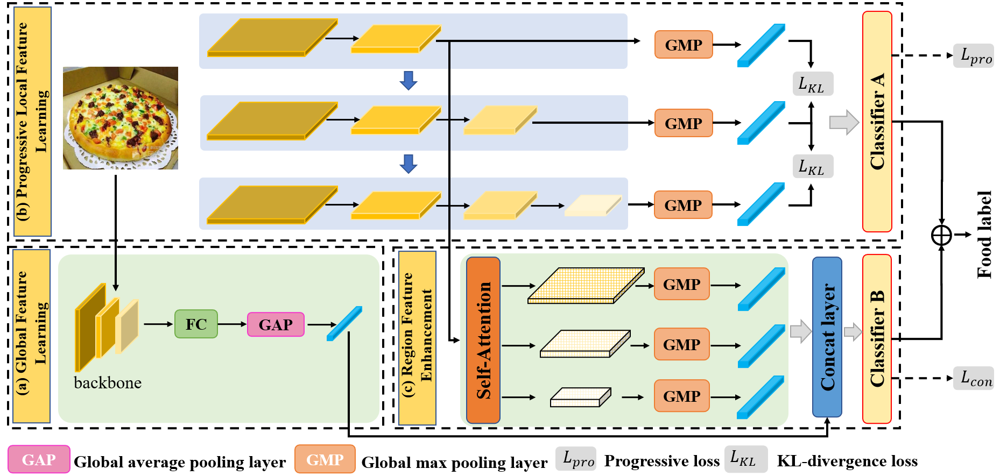

# Progressive Region Enhancement Network (PRENet)
 
Code release for Large Scale Visual Food Recognition

### Introduction


Our Progressive Region Enhancement Network (PRENet) mainly consists of progressive local feature learning and region feature enhancement. The former mainly adopts the progressive training strategy to learn complementary multi-scale finer local features, like different ingredient-relevant information. The region feature enhancement uses self-attention to incorporate richer contexts with multiple scales into local features to enhance the local feature representation. Then we fuse enhanced local features and global ones from global feature learning into the unified one via the concat layer.

During training, after progressively training the networks from different stages, we then train the whole network with the concat part, and further introduce the KL-divergence to increase the difference between stages for capturing more detailed features. For the inference, considering the complementary output from each stage and the concatenated features, we combine the prediction results from them for final food classification.
 
### Requirement
 
- python 3.6

- PyTorch >= 1.3.1

- torchvision >= 0.4.2

- PIL

- Numpy 

- dropblock

### Data preparation

1. Download the food datasets. The file structure should look like:
```
dataset
├── class_001
|      ├── 1.jpg
|      ├── 2.jpg
|      └── ...
├── class_002
|      ├── 1.jpg
|      ├── 2.jpg
|      └── ...
│── ...
```
2. Download the training and testing list files, e.g. train_full.txt, test_full.txt 


### Training

1. To train a `PRENet` on food datasets from scratch, run:
```python
python main.py --dataset <food_dataset> --image_path <data_path> --train_path <train_path> --test_path <test_path> --weight_path <pretrained_model>
```

### Inference

1. Download the pretrained model on Food2k from [google](https://drive.google.com/file/d/1gA_abY0d_0B6jXpeXNgCKBbSzc8iEHxU/view?usp=sharing)/[baidu](https://pan.baidu.com/s/1HMvBf0F-FpMIMPtuQtUE8Q)(Code: o0nj)

2. To evaluate a pre-trained `PRENet` on food datasets, run:

```
python main.py --dataset <food_dataset> --image_path <data_path> --train_path <train_path> --test_path <test_path> --weight_path <pretrained_model> --test --use_checkpoint --checkpoint <checkpoint_path>
```

### Other pretrained model on Food2K

|  CNN   | link  |
|  ----  | ----  |
| vgg16  | [google](https://drive.google.com/file/d/1r4CQEfCkwLSKz5QdZJGABldercUo5BtF/view?usp=sharing)/[baidu](https://pan.baidu.com/s/1-nI6fodmmzqz9OVqh0yvUw)(Code: puuy)|
| resnet50  | [google](https://drive.google.com/file/d/1h87m392fJIxrADTe8GMH7pibP0rjWu-k/view?usp=sharing)/[baidu](https://pan.baidu.com/s/1WY7VsCBTJt2mL9n3Gdl8Mg)(Code: 5eay) |
| resnet101  | [google](https://drive.google.com/file/d/1_xM2qv1NIjev8voYjXLhfnxDzvFNB85q/view?usp=sharing)/[baidu](https://pan.baidu.com/s/1mEO7KyJFHrkpB5G0Aj6oWw)(Code: yv1o) |
| resnet152  | [google](https://drive.google.com/file/d/1YG_gW6NftjX06-i3bCCYQhlnDo2mUoLn/view?usp=sharing)/[baidu](https://pan.baidu.com/s/1-3LikXkDEvbxQur6n-FUJw)(Code: 22zw) |
| densenet161  | [google](https://drive.google.com/file/d/17PAUHmo1vIM9b4SlbpnLnwp1a5MH9Vem/view?usp=sharing)/[baidu](https://pan.baidu.com/s/1UllqjTJMAQEnGFVgzf6-nQ)(Code: bew5) |
| inception_resnet_v2  | [google](https://drive.google.com/file/d/16PuZRuUB-YFKZT8JWycaay3JdfTlCoVK/view?usp=sharing)/[baidu](https://pan.baidu.com/s/1_974E4eZRzKubemLIQlOHA)(Code: xa8r) |
| senet154  | [google](https://drive.google.com/file/d/1FGs7gH1fYybr3sKB6q4lRl36bX5wiLXw/view?usp=sharing)/[baidu](https://pan.baidu.com/s/1tHpFFSm2AySRjDZ4BTtboQ)(Code: kwzf) |


## Contact
If you find this repo useful to your project, please consider to cite it with following bib:
```
@article{min2021large,
  title={Large scale visual food recognition},
  author={Min, Weiqing and Wang, Zhiling and Liu, Yuxin and Luo, Mengjiang and Kang, Liping and Wei, Xiaoming and Wei, Xiaolin and Jiang, Shuqiang},
  journal={arXiv preprint arXiv:2103.16107},
  year={2021}
}
```

